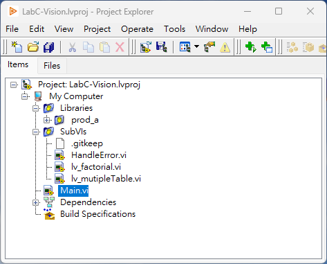
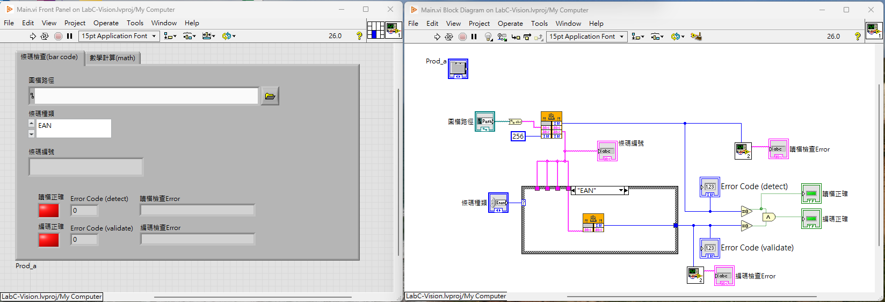
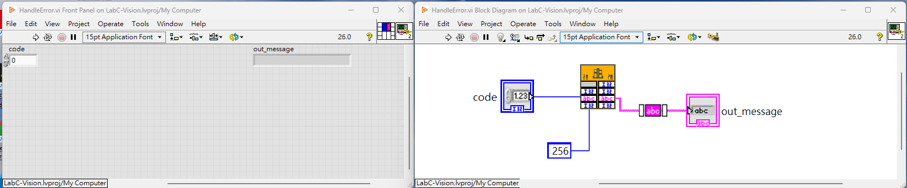
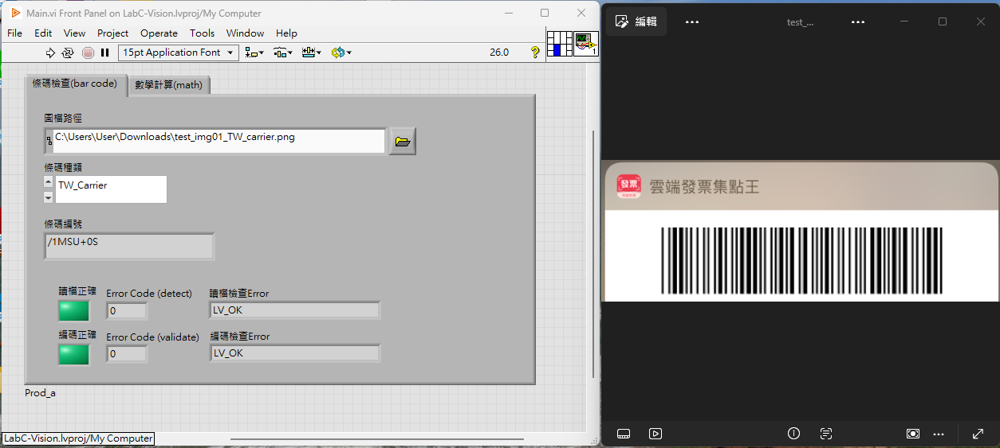
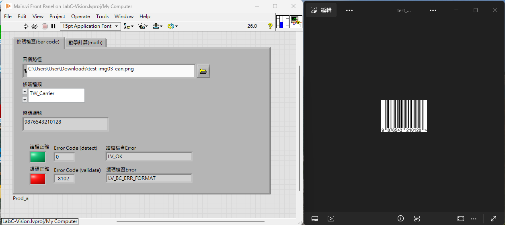
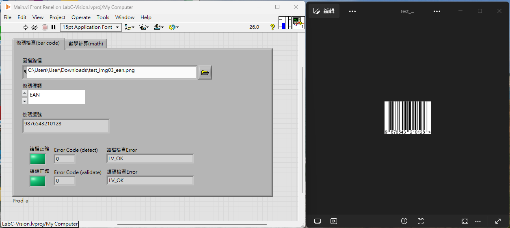
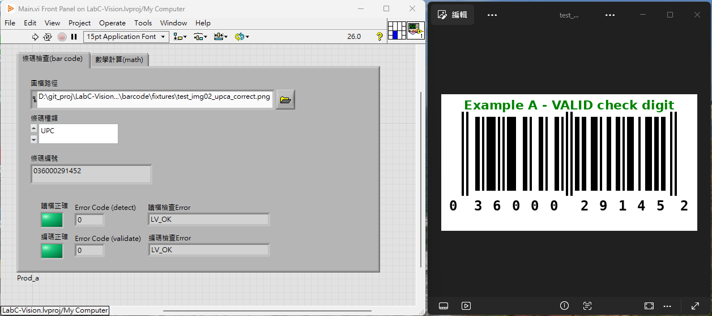
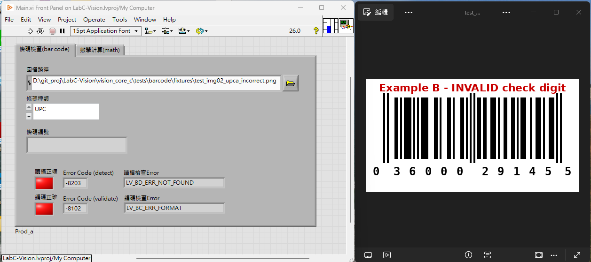

# LabC-Vision
Construction and indpection of LabVIEW (UI/HMI), C language and Computer Vision.

## 專案結構

```
LabC-Vision/
├── vision_core_c/
│   ├── include/          對外公開介面 (.h)，LabVIEW CLFN 綁定用
│   │   └── common/       跨模組共用邏輯 (例如 error_messages：錯誤碼→訊息字串)
│   ├── src/              實際邏輯實作 (.c)，內部呼叫第三方函式庫
│   ├── external/         第三方函式庫本身 (zbar、tesseract)
│   ├── deployments/      各客戶/產線客製層 (trial、prod_a…)，各自產出獨立 .dll
│   ├── tests/            單元測試
│   ├── build/            CMake 編譯中繼檔 (git 忽略)
│   └── bin/              編譯完成的 .dll 輸出位置
│
└── vision_hmi_lv/        LabVIEW 專案，負責畫面與操作流程
    ├── LabC-Vision.lvproj  LabVIEW 專案檔
    ├── Main.vi             主程式，畫面與流程控制
    ├── SubVIs/             共用子 VI，例如 HandleError（錯誤代碼轉譯）、lv_factorial、lv_mutipleTable
    ├── Libraries/          各客戶/產線客製層 (prod_a…)
    ├── Resources/          圖示、設定檔等資源
    └── builds/             編譯輸出位置 (git 忽略)
```

- 新增套件/功能時，是否要開新資料夾？ => 「這是 LabVIEW 會獨立呼叫的功能嗎？」
    - 是 → 在 `include/`、`src/` 各開一個新資料夾（比照 barcode、ocr）
    - 否 → 不用開新資料夾，寫進既有功能的 wrapper，或放進 `common/` 共用


## 資料流程：從 LabVIEW 輸入到 C 語言判斷

```
1. LabVIEW 前面板取得影像 (相機/檔案)
        ↓
2. Main.vi 裡的 Call Library Function Node (CLFN)
   把影像資料 (byte array) 與參數傳給指定的 .dll
        ↓
3. deployments/<部署>/ 產出的 .dll (例如 libvision_trial.dll)
   DLL 的匯出函式，其簽名對應 include/ 裡宣告的介面
        ↓
4. include/*.h 宣告的函式，實作在 src/*.c
   在這裡呼叫 external/ 的第三方函式庫 (zbar/tesseract) 做真正的辨識
        ↓
5. 結果 (字串/數值) 透過參數傳回 CLFN
        ↓
6. LabVIEW 顯示或做後續判斷
```

簡單說明：**LabVIEW 只負責畫面與呼叫，實際判斷邏輯都在 C 語言這邊完成，兩者透過 .dll 的固定介面溝通。**

## 錯誤處理

每個模組各自定義獨立的錯誤碼 enum（以 -100 為單位分段，避免碰撞），但錯誤碼→常數名稱字串（例如 `LV_BC_ERR_CHECKSUM` 轉成 `"LV_BC_ERR_CHECKSUM"`）的對照表統一放在 `include/common/error_messages.h` / `src/common/error_messages.c`（編成獨立的 `bin/error_messages.dll`），是唯一的訊息來源。

```
1. 任一 SubVI 呼叫的 CLFN 回傳狀態碼 (int32)
        ↓
2. LabVIEW SubVIs/HandleError.vi
   呼叫 error_messages.dll 的 lv_get_error_message 把狀態碼轉成訊息字串
        ↓
3. 合併成 LabVIEW 原生 Error Cluster，寫入 SubVIs/ErrorLogFGV.vi 的歷史紀錄 (todo)
        ↓
4. Main.vi 前面板：
   - 常駐、非阻斷的錯誤顯示區，即時顯示所有輸出的錯誤/警告訊息
   - 嚴重錯誤 (Critical) 額外跳出 LabVIEW 內建的 General Error Handler 對話框 (todo)
```

新增模組或新增錯誤碼時，記得同步在 `error_messages.c` 的對照表加一筆。

## LabVIEW GUI 實作與測試結果

### 專案架構（Project Explorer）

在 `LabC-Vision.lvproj` 中規劃以下架構：

- **Libraries／`prod_a`**：條碼影像讀取、偵測與驗證的底層邏輯，對應部署層 `deployments/prod_a/` 產出的 .dll
- **SubVIs**：共用子 VI，包括 `HandleError.vi`（錯誤代碼轉譯）、`lv_factorial.vi`、`lv_mutipleTable.vi`
- **Main.vi**：主程式進入點與人機介面（放置於專案根層）
- **Dependencies／Build Specifications**：專案相依與建置設定（LabVIEW 自動管理）



### Main.vi

- 前面板以 **Tab Control** 區分兩個功能頁：
  - 「條碼檢查 (bar code)」：圖檔路徑輸入（含瀏覽按鈕）、條碼種類下拉選單（EAN、UPC、TW_Carrier 等）、條碼編號顯示欄
  - 「數學計算 (math)」：呼叫 `lv_factorial.vi`、`lv_mutipleTable.vi` 進行運算 (todo)
- 以兩組「指示燈 + Error Code + 錯誤訊息字串」分別呈現：
  - **讀檔正確 / Error Code (detect) / 讀檔檢查Error**：檔案讀取與條碼偵測階段
  - **編碼正確 / Error Code (validate) / 編碼檢查Error**：條碼格式與檢查碼驗證階段
- 方塊圖中，先將檔案路徑與所選條碼種類（Enum）傳入底層 DLL 執行偵測，再對偵測到的字串執行驗證；兩階段的數值錯誤碼皆傳入 `HandleError.vi` 轉換為可讀訊息後顯示



### HandleError.vi

- 輸入：`code`（數值錯誤代碼）
- 邏輯：呼叫 `error_messages.dll` 的 `lv_get_error_message`，以 Case 結構依 `code` 對應到可讀訊息（如 `LV_OK`、`LV_BC_ERR_FORMAT`、`LV_BD_ERR_NOT_FOUND`）
- 輸出：`out_message`（字串），供 Main.vi 顯示於讀檔檢查Error／編碼檢查Error欄位



### 條碼實際測試

**1. 電子發票載具（TW_Carrier）— 正確可辨識**

測試檔案 `test_img01_TW_carrier.png`，條碼種類選擇 `TW_Carrier`：正確解出載具編號 `/1MSU+0S`，讀檔／編碼指示燈皆為**綠燈**，Error Code 皆為 `0`，訊息皆為 `LV_OK`。



**2. EAN-13 條碼 — 條碼種類選錯**

測試檔案 `test_img03_ean.png`，條碼種類誤選為 `TW_Carrier`：讀檔階段仍偵測到條碼（Error Code (detect) = `0`, `LV_OK`），但因種類與實際格式不符，編碼驗證階段回傳 `Error Code (validate) = -8102`（`LV_BC_ERR_FORMAT`）→ **讀檔綠燈、編碼紅燈**。



**3. EAN-13 條碼 — 條碼種類選對**

同一張 `test_img03_ean.png`，改選正確種類 `EAN`：兩項指示燈皆為**綠燈**，Error Code 皆為 `0`，正確解出條碼編號 `9876543210128`。



**4. UPC-A 條碼 — 檢查碼合法**

測試檔案 `test_img02_upca_correct.png`（檢查碼合法：`036000291452`），條碼種類 `UPC`：讀檔與編碼皆通過，**兩燈皆綠**，Error Code 皆為 `0`。



**5. UPC-A 條碼 — 檢查碼不合法**

測試檔案 `test_img02_upca_incorrect.png`（檢查碼刻意改為不合法值：`036000291455`），條碼種類 `UPC`：讀檔階段即回傳 `Error Code (detect) = -8203`（`LV_BD_ERR_NOT_FOUND`），條碼編號欄位為空白；編碼驗證階段連帶回傳 `-8102`（`LV_BC_ERR_FORMAT`）→ 顯示 zbar 在解碼當下已因檢查碼不合法直接放棄辨識，而非「讀到條碼但驗證失敗」。



### 備註：使用 zbar 套件 (標頭檔) 的限制

- 本專案透過 **zbar** 函式庫進行條碼影像解碼，zbar 對常見一維條碼格式（如 EAN-13、UPC-A）在解碼演算法內部本身就已內建檢查碼（check digit）比對機制。
- 只要解碼出的最後一碼與底層計算出的驗證碼不一致，zbar 便會判定該次解碼結果無效並直接捨棄，使 `zbar_scan_image()` 回傳 `0`（等同於「沒有偵測到條碼」）。
- 也就是說，即使圖片中確實存在條碼（例如因印刷品質不佳、光線不足、反光或解析度不足導致最後一碼判讀錯誤），zbar 也不會把「條碼存在但檢查碼錯誤」這個結果回傳給上層程式，而是直接視為「找不到條碼」。因此在目前架構下：
  - 我們無法也不需要在 LabVIEW 端針對這些常見格式再做一次獨立的檢查碼二次驗證
  - 只能先統一將這類情況歸類為「讀取檔案 (detect)」階段的錯誤（如上述 UPC-A 不合法檢查碼測試中出現的 `LV_BD_ERR_NOT_FOUND`），而非在「編碼驗證 (validate)」階段給出更精確的「檢查碼錯誤」訊息
- 這是目前受限於 zbar 底層行為所產生的限制。**未來優化方向**：
  - 改用能回傳原始解碼字串（即使檢查碼不符）的其他函式庫
  - 或自行實作影像前處理與解碼邏輯，以取得更細緻的錯誤資訊，區分「完全沒有條碼」與「條碼存在但檢查碼錯誤」兩種情境

## 開發環境設定

- C 編譯器工具鏈（MSYS2 / MinGW-w64 GCC）的安裝步驟、環境變數設定與已知問題排解，請見 [README_tech.md 2. 安裝 C 編譯軟體與環境](README_tech.md#2-安裝-c-編譯軟體與環境)。

- 一個指令建置全部模組＋跑齊單元測試，請見 [README_tech.md 3-3. CMake 建置](README_tech.md#3-3-cmake-建置推薦一個指令建置全部模組)。
